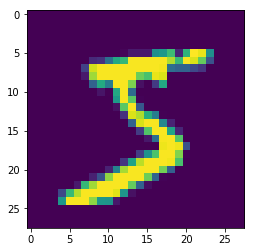

```
import numpy as np 
import gzip
import matplotlib.pyplot as plt
from sklearn.preprocessing import StandardScaler
from sklearn.decomposition import PCA
```

PCA is a dimensonality reduction (unsupervised) algorithm. The idea is to find the dimensions in which the data is highly varied and thus provides more information. 

PCA can be used for:
1. Low dimension visualization
2. Compressing (inches and cm are the same)
3. Learning on compressed data 
4. distance calculations (e.g. reducing KNN computations)


We are going to use it for compressing images of the number 5.


1

Download data from 
```
http://yann.lecun.com/exdb/mnist/
```

Use the following code to read the data:

- pay attention that you need to change the path to your downloads directory.


```

f = gzip.open('/Users/OmersGuest/Downloads/train-images-idx3-ubyte.gz','r')

image_size = 28
num_images = 25600

f.read(16)
buf = f.read(image_size * image_size * num_images)
data = np.frombuffer(buf, dtype=np.uint8).astype(np.float32)
data = data.reshape(num_images, image_size, image_size, 1)
```

```
f = gzip.open('/Users/OmersGuest/Downloads/train-labels-idx1-ubyte.gz','r')
f.read(8)
labels_list = []
for i in range(0,25600):   
    buf = f.read(1)
    labels = np.frombuffer(buf, dtype=np.uint8).astype(np.int64)
    labels_list.append(labels[0])
```
2
Choose only images where label is 5.
Notice that data contains the pixels of the images 
and labels_list the corresponding labels.

3
Plot few images to see what they look like.

Use: 
```
plt.imshow(image)
```



4
From the choosen images choose randomly 900 
of them.

5

let's reshape the array to be 900 X 784 such that each column is a pixel 
and each row is an image. 
This will be our flattened image. 


6
In PCA we have to scale the units otherwise we might consider one dimension to vary more than another based on units' falesy (1 meter vs. 100 cm)

- use standard scaler on the data


7

Run PCA on the scaled data with 30 components

8

Run the inverse to get an approximation to the original images.

use: ```pca.inverse_transform ```

9

Reshape the images back to 28 X 28 pixels.

10

Plot few examples of the original images next to their approximation


#### Cool so we might consider replacing 784 by 30 --> that's quite a compression!


[super stretch] 11

How to decide on the number of components (K) to take in PCA? One way would be to plot the ordered and scaled eigenvalues and eyeball the 'knee' in the data.
Another way would be to use different values of K and then use KNN on validation data.
Try to do one of these methods! 

